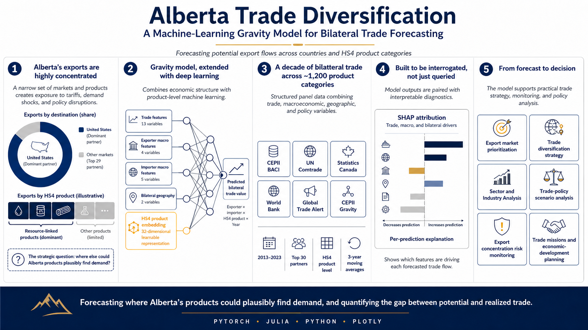

# Alberta Trade Diversification: A Machine-Learning Gravity Model for Bilateral Trade Forecasting

A neural-network extension of the classical gravity model of international trade, applied to Alberta's export portfolio at the HS4 commodity level. The model forecasts bilateral trade flows between Alberta and roughly 30 international partners across approximately 1,200 product categories, with the goal of supporting evidence-based trade diversification away from a heavy reliance on the U.S. market.

---

## Executive Summary

Alberta's export base is very concentrated. The bulk of provincial export value flows to a single trading partner (the United States) across a narrow set of resource-linked commodities. The province is therefore directly exposed to partner-specific demand shocks, commodity-price cycles, and trade-policy actions such as tariffs and renegotiated agreements. A single decision in one capital can move provincial GDP, royalty revenue, and employment. This project quantifies what a more diversified export portfolio could look like. It forecasts where Alberta's products could plausibly find demand at the country and HS4 commodity level and isolates the gap between what is realized today and what underlying economic conditions appear to support.

This project builds a machine-learning forecasting tool that estimates the size of bilateral trade flows Alberta could plausibly sustain across countries and HS4 product lines. It combines:

- The economic intuition of the gravity model (trade scales with economic mass and frictions like distance, tariffs, and policy).
- A multi-branch neural network in PyTorch with learnable HS4 commodity embeddings.
- A rich feature set covering trade-specific, macroeconomic, policy, and bilateral geographic factors.

The output is a country-by-commodity forecast for a target year that can be benchmarked against realized exports. It is designed to highlight where the structural and economic conditions support more trade than is currently being captured, supporting market prioritization and trade-strategy work.

---

## Why This Project Matters

Export concentration is one of the most measurable forms of macroeconomic exposure a region can carry. For an economy whose export base is dominated by a single partner and a narrow commodity mix, diversification is not abstract policy language. It is a quantifiable hedge against partner-specific demand shocks, sector-specific price shocks, and trade-policy events such as tariffs, sanctions, and renegotiated agreements.

The framework in this repository supports several real-world use cases:

- **Export market prioritization** at the country and HS4 commodity level.
- **Trade diversification strategy** informed by where the model identifies under-realized trade potential.
- **Sector-level opportunity screening** across 1,200+ product categories.
- **Scenario analysis** for changes in tariff, policy, or partner conditions.
- **Concentration-risk monitoring** by comparing realized vs. potential flows.
- **Evidence-based input** to trade missions, investment-attraction work, and economic-development planning.

---

## Project Overview

The forecasting task is to predict the value of bilateral trade in a given product category between an exporter and an importer for a given year. The unit of analysis is:

> (exporter, importer, HS4 commodity, year)

The target variable is the trade value (a smoothed three-year moving average of bilateral trade value, in USD thousands).

Alberta is treated as a distinct economy with its own exporter code (9999), separate from Canada. This allows the model to learn Alberta's specific export profile rather than inheriting a national average. Predictions are produced for a recent year (2025) across the modelled set of partner countries, then converted from USD to CAD using the most recent monthly exchange rate available in the data layer.

The model operates at the HS4 (4-digit Harmonized System) level, which gives roughly 1,200 unique product categories. The training panel covers 2013 through 2023 and is filtered to a top-30 set of trading partners.

---

## Methodology

### Gravity-model foundation

The gravity model of international trade predicts that bilateral flows scale with the economic mass of the two partners and decline with the frictions between them. In its standard log-linear form it explains a meaningful share of cross-sectional variation in trade volumes from variables such as GDP, distance, and contiguity.

The traditional specification has well-known limitations: it is linear in logs, treats commodities as either pooled or as independent fixed effects, and cannot easily incorporate high-cardinality categorical structure such as 1,200 HS4 codes.

### Neural-network extension

This project replaces the linear gravity specification with a feed-forward neural network that:

1. Preserves the gravity-model variables (economic mass, distance, contiguity, tariffs, policy interventions).
2. Adds learnable HS4 product embeddings so the model can represent latent similarity between commodity categories rather than treating them as independent dummies.
3. Uses separate sub-networks for trade-specific, exporter-side, importer-side, and bilateral features so each input group is processed at an appropriate width before being concatenated.

The result is a flexible, non-linear estimator that retains gravity-model intuition but can absorb non-linear interactions between, for example, importer market size, tariff regime, and product type.

### Embeddings

Each HS4 code is mapped through a learnable `nn.Embedding(num_codes, 32)` layer. The 32-dimensional vector is updated end-to-end with the rest of the model. After training, the learned embedding space encodes economic similarity between products: a downstream analysis script (`hs_embedding_analysis.py`) confirms that mean Euclidean distance between codes that share an HS2 chapter is meaningfully smaller than between codes from different chapters, and renders a 2-D PCA projection of the embedding space.

### Training

Two training entry points are provided:

- **K-fold cross-validation** (`cross_validation_trainer.py`): 5 folds, 200 epochs, Adam optimizer at lr 1e-3, batch size 2048, MSE loss. Reports per-fold MSE, R², and MAPE.
- **Early-stopping single-split training** (`early_stopping_trainer.py`): 80/20 train/validation split, periodic checkpointing, and a custom `EarlyStopping` callback that tracks the best validation loss.

---

## Data

The project uses a combination of public international-trade and macro datasets, joined and aggregated at the HS4 level. Data acquisition and cleaning are handled in the `Pre-processing/` folder using a mix of Python and Julia.

### Sources referenced in the pipeline

- **CEPII BACI** for cleaned bilateral trade flows at the HS6 level, aggregated to HS4 here.
- **UN Comtrade** for trade statistics and commodity classifications.
- **Statistics Canada** for provincial (Alberta) export data, used to insert Alberta as a distinct exporter into the BACI panel.
- **World Bank** for macro indicators (GDP per capita, tariff rates, CPI).
- **Global Trade Alert (GTA)** for counts of liberalising and harmful trade-policy interventions.
- **CEPII gravity dataset** for bilateral distance and contiguity.

### Coverage

- Time period: 2013 through 2024 for training; 2025 for out-of-sample prediction and benchmarking.
- HS level: HS4 (approximately 1,200 product categories).
- Partner countries: top-30 importer set, filtered from the full panel.
- Frequency: annual flows, with all features smoothed using a three-year moving average to reduce noise and capture trend dynamics.

### Feature set

**Trade-specific features (used in the trade sub-network):**

- `MA_AvgUnitPrice` and quality-flag companion (`MA_AvgUnitPriceFlags`).
- `MA_AvgUnitPriceofImporterFromWorld`, `MA_AvgUnitPriceofExporterToWorld`, and their flags.
- `MA_TotalImportofCmdbyReporter`, `MA_TotalExportofCmdbyPartner`.
- `MA_Trade_Complementarity`, `MA_Partner_Revealed_Comparative_Advantage`.
- `MA_Liberalising`, `MA_Harmful` (counts of trade-policy interventions from GTA).
- `Covid` indicator for 2020–2023.

**Exporter macro features:**

- Theil concentration index, GDP per capita, geopolitical-risk index, CPI.

**Importer macro features:**

- Theil concentration index, GDP per capita, weighted-average tariff rate, geopolitical-risk index, CPI.

**Bilateral features:**

- Contiguity indicator, weighted distance.

### Data availability

Raw data files are **not included in this repository**. The pipeline is designed to read processed CSVs (e.g. `MA_Trade.csv`, `MA_Exporter.csv`, `MA_Importer.csv`, `MA_Country.csv`, `MA_Trade_Alberta.csv`) from a sibling `data/` folder, and to read certain Statistics Canada tables and currency-exchange data through an ODBC connection to a SQL Server database. To reproduce the full pipeline a user would need to obtain BACI, World Bank, GTA, and Statistics Canada data directly and rebuild the processed CSVs using the scripts under `src/Pre-processing/`.

---

## Model Architecture

The model, defined in `src/model.py` as `TradeHorizonScanModel`, is a multi-branch feed-forward network. Each input group is processed independently before concatenation into a deep regression head.

**Inputs**

- `hs_idx`: integer HS4 index, fed into a 32-dimensional embedding layer.
- `trd_x`: 13 trade-specific features.
- `exp_x`: 4 exporter-side macro features.
- `imp_x`: 5 importer-side macro features.
- `cty_x`: 2 bilateral geographic features (contiguity, distance).

**Sub-networks**

| Branch       | Architecture                                  | Output dim |
|--------------|-----------------------------------------------|------------|
| Trade        | Linear(13→64) → ReLU → Linear(64→32) → ReLU   | 32         |
| Exporter     | Linear(4→16) → ReLU → Linear(16→8) → ReLU     | 8          |
| Importer     | Linear(5→16) → ReLU → Linear(16→8) → ReLU     | 8          |
| Bilateral    | Linear(2→8)  → ReLU → Linear(8→4)  → ReLU     | 4          |
| HS4 embedding| `nn.Embedding(num_codes, 32)`                 | 32         |

**Head**

The five branch outputs are concatenated into an 84-dimensional vector and passed through a 7-layer regression head with widths 64 → 128 → 256 → 512 → 256 → 128 → 64 → 1, with ReLU activations and dropout (p = 0.2) applied after the wider layers.

**Target**

A continuous trade-value target (USD thousands, three-year moving average) trained under MSE loss.

**HS4 embedding schematic**

`Figs/Embedding.jpg` shows the transformation from raw HS4 codes through integer indexing into the dense 32-dimensional embedding matrix. This embedding is the key extension over a classical gravity specification: products that play similar economic roles end up with similar vectors, and the head of the network can use that structure when predicting trade volume.

---

## Results and Visual Outputs

The `Figs/` folder currently contains a single committed asset: `Embedding.jpg`, the HS4 embedding-layer schematic. All other visual outputs described below are produced at runtime by the training, evaluation, and prediction scripts. They are not checked into the repository. Numerical performance metrics (MSE, R², MAPE) are likewise emitted to the console at the end of each cross-validation run rather than committed, so they are not reproduced here.

The cross-validation script reports MSE, R², RMSE, and per-fold MAPE. The training and prediction scripts generate a set of diagnostic and decision-support visualizations at runtime:

- **True vs. predicted scatter.** A scatter plot of held-out predictions against actual trade values across all folds, with a 45-degree reference line. Useful for spotting systematic over- or under-prediction.
- **Training and validation loss curves.** Per-epoch curves rendered with Plotly to assess convergence and overfitting.
- **Quantile-binned MAPE chart.** Decomposes prediction error across deciles of true trade value. Useful for understanding whether the model is uniformly accurate or whether errors concentrate in low- or high-volume bilateral flows.
- **HS4 embedding visualization.** A 2-D PCA projection of the 32-dimensional embedding space and a within-chapter vs. out-of-chapter Euclidean-distance comparison, produced by `hs_embedding_analysis.py`.
- **Country-level prediction vs. actual bar charts.** Per HS4 code or aggregated, produced by `Alberta_Predictions_Backend.py`. Predictions are presented in CAD using the most recent USD/CAD exchange rate. An "adjusted" series rescales raw predictions so the total matches Alberta's realized total exports for the year.

---

## Explainability and Model Interpretation

A neural network on its own is a black box. For a forecasting tool that informs trade strategy, that is not acceptable: stakeholders need to understand *why* the model assigns a particular country-commodity pair high or low predicted trade before acting on it. Two complementary explainability workflows are included in the repository.

### HS4 embedding analysis (structural interpretation)

`src/hs_embedding_analysis.py` extracts the trained 32-dimensional HS4 embedding matrix and analyzes whether the model has learned an economically meaningful representation of products. Three diagnostics are produced:

- **PCA projection.** The 32-dimensional embeddings are reduced to two dimensions via PCA and rendered as an interactive Plotly scatter labelled by HS4 code, allowing visual inspection of which products cluster together.
- **Within-chapter vs. out-of-chapter distance.** Codes are grouped by their HS2 chapter (the first two digits of the HS code, which corresponds to a broad product family). Mean Euclidean distance between embeddings of codes in the same HS2 chapter is compared against mean distance between codes in different chapters. The expected result is that the within-chapter distance is meaningfully smaller, confirming that the embedding has internalized the official product hierarchy without being told it.
- **Nearest-neighbour lookup.** A `get_top_n_similar_codes` utility returns the closest HS4 codes to any given product in embedding space. This provides a direct interpretability tool: for any commodity, the analyst can see which other products the model treats as economically similar and sanity-check those neighbours against domain knowledge.

This analysis is the structural counterpart to feature attribution. It explains *how the model represents the product universe*, which is critical because so much of the model's predictive power flows through the embedding layer.

### SHAP-based feature attribution (per-prediction interpretation)

`src/Shapley Analysis.py` applies SHAP (SHapley Additive exPlanations) to the trained model to produce per-prediction feature contributions. The setup uses `shap.DeepExplainer` against the multi-input PyTorch model, with a small held-out background sample drawn from the training loader to anchor the baseline expectation. Inputs are explained one branch at a time (trade features, exporter macro, importer macro, bilateral, HS embedding) so that contributions can be read at the level of meaningful economic variables rather than raw tensor positions.

The intent is to answer questions of the form:

- For a given Alberta-to-Country-X forecast on a given HS4 product, *which features pulled the prediction up and which pulled it down*?
- Across the validation panel, which features matter most on average, and which only matter conditionally (for example, tariff rates that bite only when paired with high importer demand)?
- Where do the model's reasons disagree with classical gravity-model intuition, and is that disagreement defensible?

### Why this matters

Together, the embedding analysis and SHAP attribution provide two layers of interpretability that map well to how trade and finance stakeholders actually consume model output:

- The embedding analysis answers the *strategic* question (does the model see products the way an economist would?).
- The SHAP attribution answers the *tactical* question (for this specific country-product forecast, what is the model reacting to?).

---

## Limitations

This is a research and portfolio project. The following limitations are worth acknowledging.

- **Predictive, not causal.** The model estimates conditional expectations of bilateral trade given features. It is not a structural model of trade and should not be interpreted causally (e.g. the effect of a hypothetical tariff change cannot be read directly off feature coefficients).
- **Data dependencies.** The pipeline depends on external data layers (an institutional SQL Server, BACI, Statistics Canada exports). Raw data is not bundled with the repository.
- **Missing-value handling.** Several trade-specific features rely on simple imputation strategies (mean fill, zero fill with a flag, Canada-as-fallback for Alberta) that are pragmatic but introduce noise.
- **Partner coverage.** Modelling is restricted to a top-30 importer set rather than the full universe of partners, so smaller-but-strategic markets may be excluded.

---

## Future Work

- **Explainability.** Promote the SHAP-based attribution pipeline from exploratory to production: stable summary plots, per-prediction waterfalls, and integration of feature contributions into the country-by-HS4 prediction backend.
- **Classical-gravity benchmark.** Add a fixed-effects PPML gravity-model baseline to quantify the lift contributed by the neural extension and the HS4 embedding.
- **Scenario engine.** Wrap the trained model in a what-if layer so users can perturb tariffs, policy counts, or macro variables and read off updated bilateral forecasts.
- **Decision-maker dashboard.** Productionize the country-by-HS4 outputs in an interactive dashboard for trade-strategy and economic-development users, with drill-down by sector.

